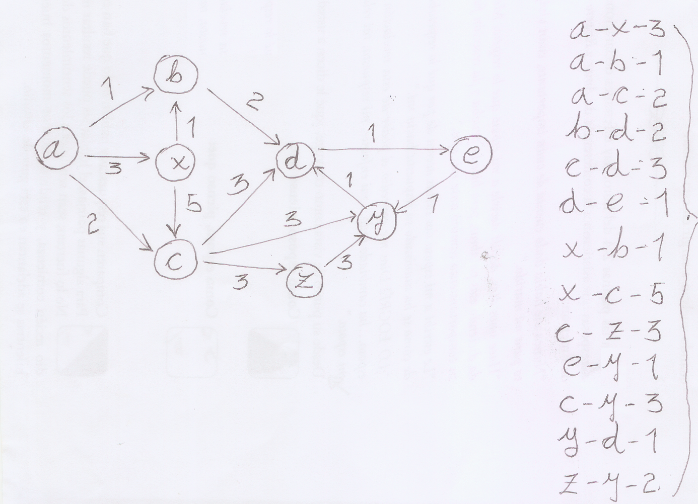

# Flight Tracker

This CLI application reads a flight connection table (including prices) and then answers questions about stops and prices.

## Getting Started

### Prerequisites

* JDK 1.8. The JAVA_HOME environment varariable must point to that JDK and JDK's binaries must be included in system's PATH.
* Any of these build systems:
    * Maven 3.3.9
    * Gradle 3.5
    * Ant 1.9.x
 git

### Installing

Copy flitetrakr.zip to the desired folder and unzip it. 

```
$ unzip flitetrakr.zip
```

Move to the **flitetrakr** folder just created after unzipping . 

```
$ cd flitetrakr
```

Build the application using the build system of your choice from the list in the **prerequisites** section.

#### Maven

```
$ mvn clean
$ mvn package
```

#### Gradle

```
$ gradle clean
$ gradle build
```

#### Ant

```
$ ant clean
$ ant
```

Make sure that you are connected to the Internet such that build system can resolve dependencies. The test cases executed by the build process may catch someone's attention in spite of the are not devised to illustrate application's capabilities; do not hover too much over JUNit test logs and please follow instructions in the next section in order check how the application works.  


## Playing with the Application 
The *flitetrakr/data* folder contains two files (namely *connections-1.txt* and *connections-2.txt*). For each scenario represented by these files, I pasted the corresponding directed graph and a output collected from command line.  

### First Scenario: connections-1.txt.


This file is a directed graph extracted from a text book. The following listing shows a couple of interesting queries.

```
$ java -jar target/flitetrakr-1.0-SNAPSHOT.jar  data/connections-1.txt
1: What is the cheapest connection from A to E ?
1: A-B-D-E-4

2: What is the price of the connection A-X-C-D-E?
2: 12

3: How many different connections with maximum 3 stops exist between X and E?
3: 3

4: How many different connections with maximum 2 stops exist between X and E?
4: 2

5: How many different connections with exactly 3 stop exists between A and E?
5: 3

6: How many different connections with minimum 4 stop exists between A and Y?
6: 2

7: How many different connections with minimum 2 stop exists between X and Y?
7: 3

8: Find all connections from A to E below 7 Euros!
8: A-B-D-E-4, A-C-D-E-6

9: Find all connections from A to E below 6 Euros!
9: A-B-D-E-4

10: Find all connections from A to E below 4 Euros!
10: No such connection found!
$ 
```
### Second Scenario: connections-2.txt.


This file contains the sample input and questions found in the [challenge page](https://bitbucket.org/adigsd/backend-flitetrakr). All answers match except *#7*; in this case the challenge answer is **2** whilst program output is **1**. However, if we ask the application to take into account repeated stops at the same place (by setting **-Dcom.assessment.flitetrakr.multiple=true**), we get a perfect match. Check the next two listings in order to catch the situation.

####  Listing 1: Ignoring repeated stops at the same place.
```
$ java -jar target/flitetrakr-1.0-SNAPSHOT.jar  data/connections-2.txt 
1: What is the price of the connection NUE-FRA-LHR?
1: 70

2: What is the price of the connection NUE-AMS-LHR?
2: No such connection found!

3: What is the price of the connection NUE-FRA-LHR-NUE?
3: 93

4: What is the cheapest connection from NUE to AMS?
4: NUE-FRA-AMS-60

5: What is the cheapest connection from AMS to FRA?
5: No such connection found!

6: What is the cheapest connection from LHR to LHR?
6: LHR-NUE-FRA-LHR-93

7: How many different connections with maximum 3 stops exists between NUE and FRA?
7: 1

8: How many different connections with exactly 1 stop exists between LHR and AMS?
8: 1

9: Find all connections from NUE to LHR below 170Euros!
9: NUE-FRA-LHR-70, NUE-FRA-LHR-NUE-FRA-LHR-163
$

```
####  Listing 2: Counting repeated stops at the same place.
```
$ java -Dcom.assessment.flitetrakr.multiple=true -jar target/flitetrakr-1.0-SNAPSHOT.jar  data/connections-2.txt
1: What is the price of the connection NUE-FRA-LHR?
1: 70

2: What is the price of the connection NUE-AMS-LHR?
2: No such connection found!

3: What is the price of the connection NUE-FRA-LHR-NUE?
3: 93

4: What is the cheapest connection from NUE to AMS?
4: NUE-FRA-AMS-60

5: What is the cheapest connection from AMS to FRA?
5: No such connection found!

6: What is the cheapest connection from LHR to LHR?
6: LHR-NUE-FRA-LHR-93

7: How many different connections with maximum 3 stops exists between NUE and FRA?
7: 2

8: How many different connections with exactly 1 stop exists between LHR and AMS?
8: 1

9: Find all connections from NUE to LHR below 170Euros!
9: NUE-FRA-LHR-70, NUE-FRA-LHR-NUE-FRA-LHR-163
$

```

Since all links between two airports are unidirectional (as implied by the connection format **&lt;code-of-departure-airport&gt;-&lt;code-of-arrival-airport&gt;-&lt;price-in-euro&gt;**), it is quite straight forward to understand why question #7 yield different answers by just taking a look at the directed graph.
 
